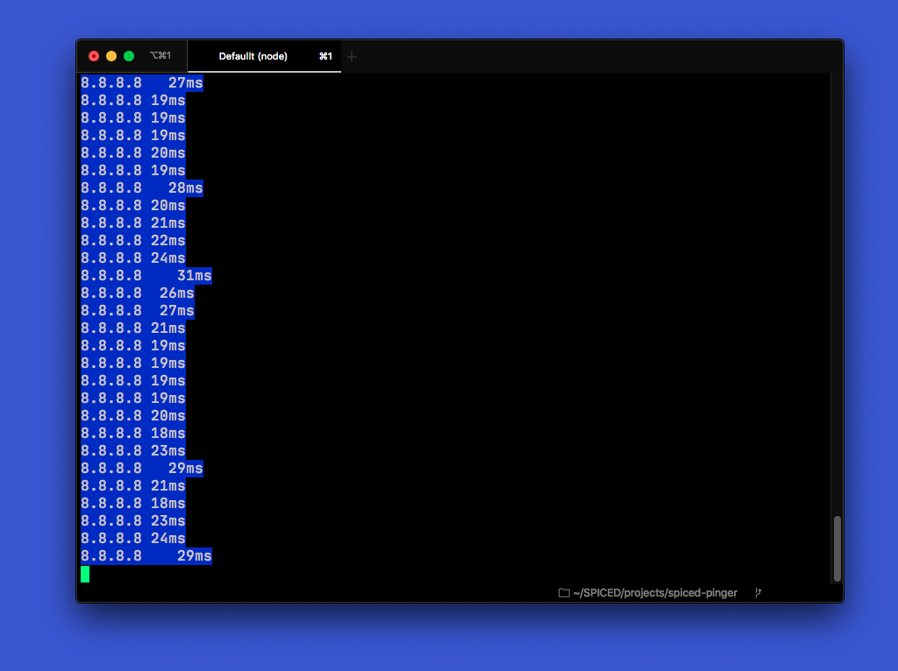

# Pinger for online lectures

So, you are teaching online, and you get that weird feeling because you don't know if you are still online. This tool helps with this.

It is a VERY stupid and simple CLI script, which will show you the current ping times to 8.8.8.8 as an indicator for your screen sharing connection speed.

It will look like this:

## But…

Yes, there are better tools, and if you like other tools better, you should use those. This one makes me happy, and I though I'd share it with you.

## Why doesn't it…

Create a pull request! I will be happy to add it if it makes this stupid little tool better. 😎

# Install and start

1. Clone the repository
2. Run `npm install`
3. Run `npm start`

